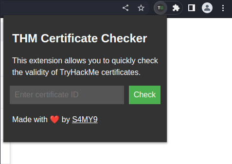

# THM Certificate Checker

The THM Certificate Checker is a Chrome Extension that allows users to quickly check the validity of TryHackMe (THM) certificates right on the browser. This lightweight and user-friendly extension eliminates the need to navigate through multiple pages or tools to verify earned certificates.

## Installation

To install the THM Certificate Checker Chrome Extension, follow these steps:

1. Download or clone this repository to your local machine.
2. Open Google Chrome and navigate to `chrome://extensions/`.
3. Enable "Developer mode" by toggling the switch in the top right corner.
4. Click the "Load unpacked" button and select the downloaded or cloned repository folder.
5. The extension is now installed and ready to use.

Alternatively, you can wait for the extension to be available on the Chrome Web Store.

## License

This project is released under the [MIT License](LICENSE).
